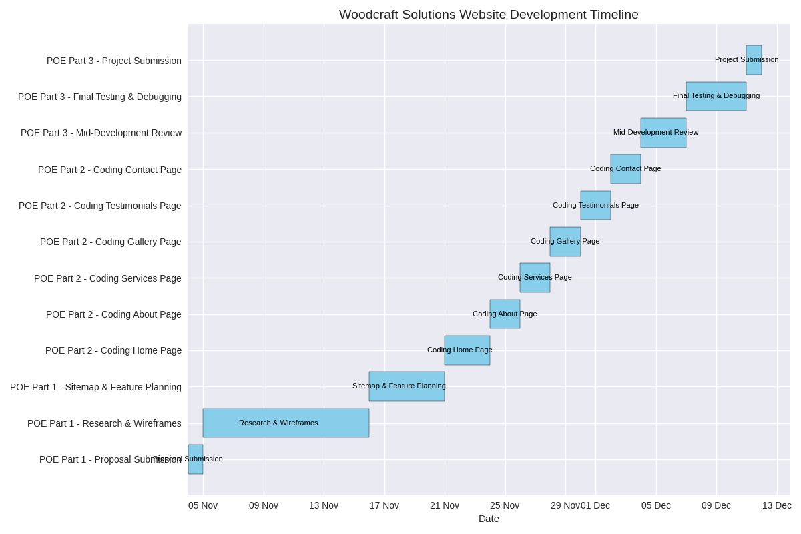

# Wood-Craft-Solution

**Student Full Name: **Abou Gbane 
**Student Number:** ST10489481 
**Module Code:** WEDE5020 
**Assessment Type:** POE Part 2 
Group 2 
 

​# Proposal 2: Woodcraft Solutions (Small Business) 

## 1. Organization Overview 

**Name:** Woodcraft Solutions 

**History:** Founded in 2018 by a master carpenter with over 15 years of experience, Woodcraft Solutions is a Brisbane-based firm that offers custom woodworking, home repair, furniture design, and complete-home remodeling for home clients. 

**Mission Statement:** To introduce craftsmanship, quality, and integrity into each home project. 

**Vision Statement:** :To be the go-to provider of bespoke woodwork and renovations in Southeast Queensland. 

**Target Audience: **
Home owners 
Interior designers 
Property investors 
Renovations 

** 2. Website Goals and Objectives **
**Goals: **
Goal 1: Showcase and sell custom woodwork and furniture designs.
Objective 1: Develop a website with an e-commerce section that allows users to browse, select, and purchase custom woodwork and furniture directly online.

Goal 2: Display client testimonials to build trust and credibility.
Objective 2: Create a dedicated testimonials page featuring client reviews, project images, and ratings to highlight customer satisfaction and craftsmanship quality.

Goal 3: Provide a streamlined way for potential clients to request quotes.
Objective 3: Implement an interactive quote request form that collects project details, preferred timelines, and contact information for follow-up.

Goal 4: Increase brand visibility and online engagement.
Objective 4: Optimize the website for search engines (SEO), integrate social media links, and publish blog content showcasing woodworking tips and project stories.

Goal 5: Improve user experience across devices.
Objective 5: Design a responsive website layout that adapts seamlessly to mobile, tablet, and desktop screens for easy navigation and interaction.

Goal 6: Highlight the company’s services and expertise.
Objective 6: Build a services page with detailed descriptions, images, and benefits of each offering—such as furniture design, repairs, and full renovations. 

Metric                      Target 
Monthly visitors            1,000+ 
Service inquiries/month     50+ 
Quote requests submitted    20+ 
Engagement time on site     > 2 minutes 

 

3**. Current Website Analysis**  
Strengths                       Weaknesses 
Image gallery of projects       No mobile optimization 
Business contact details        No quote form 
Service pages                   Outdated layout 

**Areas for Improvement:** 
.Add mobile responsiveness 
.Implement quote form and testimonial section 
.Improve visual design and navigation 

 

**4. Proposed Website Features and Functionality **
Common Features Across All Pages
These elements will appear consistently across all five pages (Home, About, Services, Testimonials, Contact):

**Company Logo:** Positioned in the header for brand identity
Top-Level Navigation Menu: Easy access to all pages with hover effects and active page highlighting
Responsive Design: Mobile-friendly layout with adaptive elements for tablets and desktops

**Slogan/Tagline:**
Displayed prominently on the homepage and footer (e.g., “Craftsmanship You Can Trust”)

**Footer Section:**
Quick links to all pages
Social media icons (Facebook, Instagram, Pinterest)
Copyright notice

**Consistent Typography:** Headings in Playfair Display, body text in Roboto Regular
Color Scheme: Warm Brown, White, Slate Grey, Black
SEO Optimization: Meta tags, alt text, and structured data for better search visibility
Accessibility Features: Alt text for images, keyboard navigation, readable contrast ratios
 
**Homepage**
 Hero banner with high-quality image and slogan
Introduction to the business
Call-to-action buttons (e.g., “Request a Quote”, “View Portfolio”)
Featured services preview
Testimonials carousel or preview
Quick contact snippet in footer

 **About Us Page**
Company history and mission/vision statements
Founder’s story and experience
Team introduction (optional)
Embedded YouTube video showcasing craftsmanship
High-resolution images of past projects

**Services Page**
Detailed list of services with icons or images
Expandable sections or tabs for each service category
Call-to-action buttons (e.g., “Get a Quote”, “See Gallery”)
Testimonials related to specific services
Downloadable brochure or service catalog (optional)

**Testimonials Page**
Client reviews with names and project images
Star ratings or satisfaction indicators
Filter or sort by service type
Option to submit a testimonial via form
Visual layout using cards or grid

**Contact Us Page**
Rich contact information:
Physical address
Email
Phone number
Business hours
Google Maps Embed: Interactive map showing business location
Google Form or Custom Contact Form:
Name, email, phone
Message box
Service interest dropdown
Social media links
Quick quote request button
Accessibility-friendly layout

**5. Design and User Experience **
**Colour Scheme:**Warm Brown,white, Slate Grey, Black 
**Headings: **Playfair Display 
**Body:** Roboto Regular 
**Layout and Design:**High-quality image 

**User Experience: **
Quick navigation 
CTA buttons (Request a Quote, View Portfolio) 
Mobile and desktop usability 

 
6. **Technical Requirements **

**Domain:** www.timbercraftsolutions.com.au 
**Technologies: **
HTML5, CSS3 
JavaScript 
WordPress  
Image Optimization tools 

 
7. **Timeline and Milestones **

 **
8. Budget **
Item                     Estimated Cost 
Domain Registration      R400/year 
Hosting                  R1300/year 
Development              R0 
Maintenance              R2250/year 
Total                    R3950/year 

## 9.Change log 
**Part 1**
Content Expansion & Structure Fixes
Added missing "main" and "footer" tags to testimonials.html, services.html, and gallery.html
Inserted closing "/body>" and "/html>" tags in gallery.html

**Expanded homepage content with:**
Introduction
,Why Choose Us section
,Featured Services
And Call-to-action buttons

**Contact Page Enhancements**
Added rich contact information (address, email, phone)
.Embedded Google Maps iframe.Embedded Google Form for quote/contact submissions.Listed business hours

**Quote Page Improvements**
Structured quotation content with headings and bullet points.Added client acceptance section with signature and date placeholders.Included payment terms and conditions

**Gallery & Testimonials Updates**
Improved alt text for all images for accessibility and SEO.Added client testimonials with names, images, and feedback.Structured testimonials using "section" tags

**Code Documentation**
Added HTML comments across all pages to explain each section.Improved readability and maintainability of code

**Content Archiving**
Saved all website text content in a .txt file and placed it in the _private folder for backup and documentation

**Part 2**

Implement all changes recommended in POE Part 1.

All recommendations given to improve the proposal have have been implemented.

Content coded in some of the footer area.Code is formated,And I Avoid unnecesary whitespace. 

 
Sitemap 

 Wireframe 

  **Bibliography **
JenWoodHouse.com. Wood bead garland, distressed shelves & hanging planters [image online]. Available at: https://www.jenwoodhouse.com (Accessed: 27 August 2025). 

Marty’s Musings. Rustic coffee / side table made from reclaimed materials [image online]. Available at: https://www.martysmusings.net (Accessed: 27 August 2025). 

Muffin Group. (2023) Massachusetts Woodworks – example of a woodworking business website with high-quality imagery, minimalist design, and testimonials. Available at: https://muffingroup.com/blog/woodworking-websites (Accessed: 28 August 2025). 

StartAtHomeDecor.com. Reclaimed wood floating shelves above a sofa [image online]. Available at: https://www.startathomedecor.com (Accessed: 27 August 2025). 

The Spruce / Christopher Lee Foto. Bright living room with built-in shelving [image online]. Available at: https://www.thespruce.com (Accessed: 27 August 2025). 

VermontWoodsStudios.com. Elegant freestanding bookcase [image online]. Available at: https://www.vermontwoodsstudios.com (Accessed: 27 August 2025). 

Yelp.com. Built-in cabinetry / custom shelves. Yelp / Woodworking Search Result [image online]. Available at: https://www.yelp.com (Accessed: 27 August 2025). 

Yelp.com. Modern kitchen cabinetry. Yelp / Custom Bookshelves Search Result [image online]. Available at: https://www.yelp.com (Accessed: 27 August 2025). 

YouTube. Geometric or lantern-inspired wood decor accents. YouTube video thumbnail [image online]. Available at: https://www.youtube.com (Accessed: 27 August 2025). 

**Change Log**
In the updated h1 style, a few changes were made to improve how it looks and works. First, the border-bottom was given a color (#fff) because the original version didn’t have one, which could make the underline invisible depending on the background. The margin was changed from 0% to 0, since using a percentage there isn't correct. A new font, 'Merriweather', was also added to make the heading look more professional and match the theme of the website. Lastly, font-weight: 700 was added to make sure the heading stays bold when using the new font. These changes help the heading stand out more and look cleaner on the page.

 github link
 https://github.com/ST10489481/Woodcraft-Solution/tree/main
